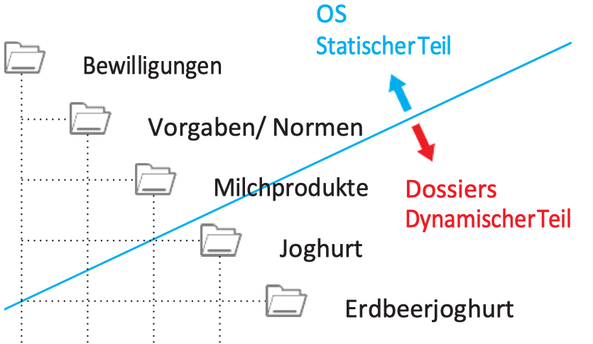

# Dossierbildung

 (1).png>)

### **Definition**

**Das Dossier ist der schriftliche Niederschlag eines Geschäfts.** Oder anders ausgedrückt: Dossiers werden aus einem Geschäftszusammenhang heraus gebildet. Dossiers enthalten alle selbst erstellten oder empfangenen geschäftsrelevanten Records, z.B. Berichte, Protokolle, Briefe, E-​Mails. Dazu gehören nicht nur Unterlagen mit Textinformationen, sondern auch andere Informationsarten, z.B. Fotos, Pläne, Karten. Die Aufgabe eines Dossiers besteht darin, die Geschäftsvorgänge unterschiedlicher Ausprägung lückenlos nachvollziehbar zu dokumentieren.

Dossiers sind logische oder physische Behältnisse, sie bilden eine Klammer um die Records eines Geschäfts. Beispiele für Dossierablagen sind:

* **Analog:** Hängeregister, Bundesordner
* **Digital:** ERM (Electronic Records Management System), Geschäftsverwaltungssystem, Fachapplikation, Dateiablage, Kennung durch Metadaten

### Dossiers im Lebenszyklus

Wichtig ist, dass Dossiers über den Lebenszyklus hinweg mit adäquaten Werkzeugen verwaltet werden können. Die Anforderungen ändern sich je nach Lebensphase. In der **aktiven Phase** braucht es Systeme, die mit zahlreichen Änderungen umgehen und beispielsweise kollaborative Arbeitsinstrumente zur Verfügung stellen. In der **passiven Phase** (Aufbewahrung, Archivierung) geht es darum, die Authentizität und Integrität der Dossiers zu schützen. Wichtig ist also, dass die Produktivsysteme der aktiven Phase in der Lage sind, die Daten und Metadaten von Dossiers zu exportieren und an ein Archivsystem (OAIS) zu übergeben. Manche Hersteller von GEVER-Systemen und Fachapplikationen sehen diese Notwendigkeit nicht ein und propagieren, dass sie auch "Archivierungsmodule" zur Verfügung stellen. Eine applikationsunabhängige Archivierung ist aber so nicht möglich. Im Gegenteil: Diese Systemhersteller bauen einen ummauerten Garten um die Daten und machen die Datenakquise für das Archiv um so schwieriger (Siehe Kp. 3)

.png>)

Dossiers werden zeitlich beschränkt aktiv bewirtschaftet. Sie sind dynamisch, das heisst sie werden eröffnet, angereichert, verändert und irgendwann, wenn ein Geschäft abgeschlossen ist, auch wieder abgeschlossen. Dossiers haben also immer einen Beginn und ein Ende. Es gibt keine "ewigen" Dossiers.

Das **Lebenszyklusmodell der Kantonsverwaltung Wallis** veranschaulicht dies. Die Dossiers sind während einer bestimmten Dauer für die Nutzung offen. Dann werden sie geschlossen und unterliegen der Aufbewahrung. Die Grafik zeigt auch, mit wie vielfältigen Typen von Dokumenten und Daten in der Verwaltung gearbeitet wird. Das Staatsarchiv muss in der Lage sein, diese schliesslich übernehmen zu können.

### Geschäft und Dossier

**Ein Geschäft ist ein Vorgang. Das Dossier ist der schriftliche Niederschlag dieses Vorgangs** Ein Dossier umfasst alle Unterlagen (Records) eines Prozessdurchlaufs. Das Dossier bündelt die Unterlagen, die während dem Geschäft entstehen.

Beispielsweise bildet die Einbürgerung einer Person ein Geschäft. Die im Zusammenhang mit diesem Geschäft eingereichten oder erstellten Dokumente (Records) bilden zusammen das Dossier, welches die Einbürgerung dieser Person **nachvollziehbar** macht.

.png>)

### Dossiertypen

Dossiers können kategorisiert und in Typen unterteilt weden. Die Kategorisierung hilft bei der Steuerung der Dossiers im Lebenszyklus. Zudem können in Records Management- und GEVER-Systemen Templates angelegt werden. Im normalen Verwaltungsalltag genügen die folgenden vier Dossiertypen:

**Geschäftsdossier**

Projekte, Regierungs- oder Parlamentsgeschäfte, Anträge. Solche Dossiers haben einen klaren Anfang und ein Ende. Es handelt sich um den häufigsten Dossiertyp. Es handelt sich um den häufigsten Dossiertyp.&#x20;

* Prozesse, die immer gleich ablaufen: Einbürgerung, Vergabeverfahren, Vertag bewirtschaften&#x20;
* Prozesse, die einmalig oder selten ablaufen: Z. B. Einführung eines neues Softwaresystems nach einem standardisierten Vorgehen&#x20;
* Prozesse, bei denen eine Projektmethodik das Vorgehen vorgeben (z. B. Scrum, Hermes), Projektdossiers

**Periodendossiers**

Gewisse Geschäfte laufen scheinbar ewig weiter. Damit die Übersicht nicht verloren geht, sollen sie nach einer bestimmten Anzahl Jahre geschlossen werden. In der öffentlichen Verwaltung geschieht das oft am Ende der Legislatur. Innerhalb solcher Dossiers können Jahres-​Subdossiers oder thematische Subdossiers gebildet werden.&#x20;

* Budgetierung, Rechnungsführung, wiederkehrende Beiträge an Institutionen&#x20;
* Kommissionen, Arbeitsgruppen: Dossier pro Sitzung, pro Jahr, pro Amtsperiode

**Subjekt-/Objektdossiers**

Subjekte sind: Personen, Kunden, Mitarbeitende, Patienten, Unternehmen. Objekte sind: Gebäude, Grundstücke, Fahrzeuge, Geräte. Diese Dossiers dokumentieren Einzelprozesse im Zusammenhang mit diesen Einheiten.

* Subjekt: Einstellungsprozess, Bestellung, Unfalldokumentation&#x20;
* Objekt: Gebäuderenovation, Fahrzeugkauf, Fahrzeugreparatur

**Themendossiers**

Thematische Gliederung, z. B. im Wissensmanagement&#x20;

* Fachwissen&#x20;
* Arbeitsgrundlagen wie Merkblätter, Listen, Vorlagen&#x20;
* Dokumentation&#x20;
* Handbibliothek

 (2).png>)

Quellen zu Dossierbildung:&#x20;

* Kt. Solothurn: [https://so.ch/staatskanzlei/staatsarchiv/dienstleistungen-fuer-amtsstellen/dossierbildung/dossiertypen/](https://so.ch/staatskanzlei/staatsarchiv/dienstleistungen-fuer-amtsstellen/dossierbildung/dossiertypen/)
* Merkblatt Kt. St. Gallen: [https://www.sg.ch/content/dam/sgch/kultur/staatsarchiv/pdf\_archivbenutzung/aktenf%C3%BChrung/Merkblatt%20Dossierbildung.pdf](https://www.sg.ch/content/dam/sgch/kultur/staatsarchiv/pdf\_archivbenutzung/aktenf%C3%BChrung/Merkblatt%20Dossierbildung.pdf)
* Kt. Zug: [https://www.zg.ch/behoerden/staatskanzlei/staatsarchiv/gever-die-elektronische-geschaeftsverwaltung/gever/5.-dossierfuehrung-allgemein/5.1.-dossierbildung ](https://www.zg.ch/behoerden/staatskanzlei/staatsarchiv/gever-die-elektronische-geschaeftsverwaltung/gever/5.-dossierfuehrung-allgemein/5.1.-dossierbildung)

