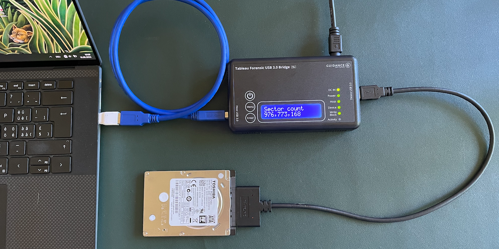

# Installation DPL

## Einleitung

Dieses Kapitel beschreibt die Installation des DPL (Digital Preservation Lab). Das ist eine virtuelle Maschine (VM), auf welcher alle Werkzeuge vorinstalliert sind, die Sie in LEZY2 benötigen.&#x20;

Die VM wird mit Hilfe eines Skripts automatisch installiert. Sie können sie jederzeit löschen und wieder neu installieren.&#x20;

## Vorgehen

### Virtualbox installieren

Gehen Sie auf folgende Seite: [https://www.virtualbox.org/wiki/Downloads](https://www.virtualbox.org/wiki/Downloads)&#x20;

Laden Sie sowohl das "Platform Package" für Ihr Betriebssystem wie auf das "Extension Pack" herunter.

Starten Sie den Installer und klicken Sie auf "Weiter", bis die Installation beginnt:

.png>)

Nach der Installation starten Sie Virtualbox:

.png>)

Gehen Sie auf Datei --> Einstellungen und öffnen Sie den Reiter "Zusatzpakete":

KIicken Sie rechts auf das "+"-Zeichen und wählen Sie die Extension-Datei aus, die Sie ebenfalls heruntergeladen haben. Das Extension Pack wird installiert:

.png>)

Virtualbox ist nun bereit.

### Vagrant installieren

Gehen Sie auf folgende Seite: [https://www.vagrantup.com/downloads](https://www.vagrantup.com/downloads)

Laden Sie die aktuelle "Amd64"-Version herunter

Starten Sie den Installer, klicken Sie auf "Weiter", bis die Installation beginnt:

.png>)

Die Installation dauert einige Minuten, danach muss der Computer neu gestartet werden.

### DPL installieren

Gehen Sie auf folgende Seite: [https://github.com/wildit/dpl-provision](https://github.com/wildit/dpl-provision)

Laden Sie das Git-Repository als ZIP-Datei herunter "Code" --> "Download ZIP"

.png>)

Entpacken Sie den ZIP-Container&#x20;
